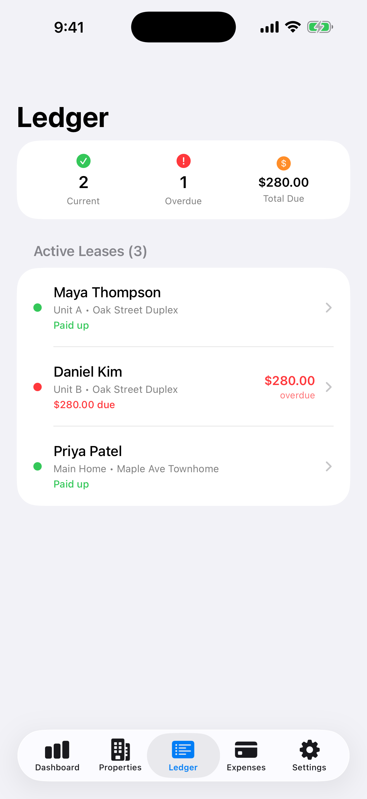

"Who paid this month?" and "when does that lease end?" are two questions every landlord should be able to answer in seconds. A lot of us answer them from memory, and memory has a bad habit of failing at the worst moment.

<figure style="max-width:360px;margin:1.5rem auto">
<video controls playsinline preload="metadata" poster="/randall/videos/rental-manager-leases-poster.jpg" aria-label="Rental Manager leases demonstration with demo data" style="display:block;width:100%;max-width:360px;border-radius:14px;background:#15110d">
  <source src="/randall/videos/rental-manager-leases.mp4" type="video/mp4" />
  Your browser does not support embedded video.
</video>
<figcaption>Demo data. AI-generated narration.</figcaption>
</figure>

## The two things that slip

**Late rent.** It's easy to assume everyone paid. A few days later you realize one tenant hasn't, and now you're starting the conversation late.

**Lease end dates.** Miss the renewal window and you may find yourself with a tenant on an awkward month-to-month arrangement, or scrambling to find someone new on short notice.

## What to track for every lease

- Tenant, property and unit
- Rent amount and due date
- What's been paid and what's outstanding
- Start and end date
- When to start the renewal conversation

## Make the app do the remembering

Rental Manager's **Ledger** lists every active lease in one place. Paid-up tenants show in green. Anyone overdue shows in red with the amount due, and the top of the screen gives you counts for current, overdue and total due.

*Demo data.*

**Reminders** handle the rest. In Settings you can switch on:

- a reminder the morning rent is due for each active lease
- a late-rent reminder if a charge is still unpaid after your grace period
- lease renewal reminders 60 and 30 days before a lease ends
- mortgage and deposit-deadline reminders

You choose the time of day, the number of grace days, and the deposit deadline. Reminders are scheduled on your device.

## A simple weekly check

On the first of the month and again mid-month: open the Ledger, look for red, and act on it that day.

Rental Manager helps you stay organized. It doesn't collect rent for you or provide legal advice, so check your local rules on late fees and notice periods.

**[Download Rental Manager: Rent & Taxes on the App Store](https://apps.apple.com/us/app/rental-manager-rent-taxes/id6758280423)**
