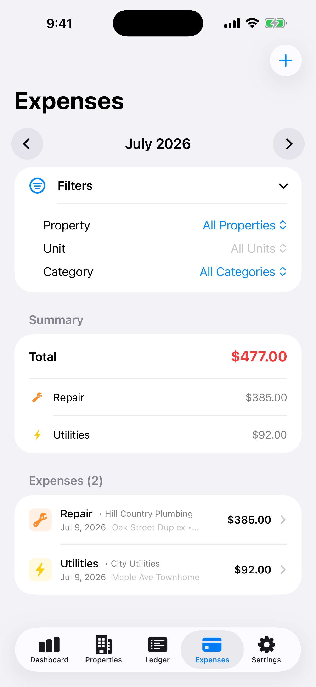

Keeping track of rental expenses can be surprisingly difficult when you manage properties yourself.

A faucet repair in March. A utility bill in June. A trip to the hardware store you paid for with whatever card was in your pocket. By the time the year is over, those expenses are scattered across bank statements, email receipts and a shoebox.

<figure style="max-width:360px;margin:1.5rem auto">
<video controls playsinline preload="metadata" poster="/videos/rental-manager-expenses-poster.jpg" aria-label="Rental Manager expenses demonstration with demo data" style="display:block;width:100%;max-width:360px;border-radius:14px;background:#15110d">
  <source src="/videos/rental-manager-expenses.mp4" type="video/mp4" />
  Your browser does not support embedded video.
</video>
<figcaption>Demo data. AI-generated narration.</figcaption>
</figure>

## Why scattered expenses cost you

- **You forget things.** Every expense you can't find is one you can't account for.
- **Questions become guesses.** "How much did the duplex cost me this year?" shouldn't need an afternoon of digging.
- **Everything bunches up at once.** Sorting twelve months of spending in one sitting is miserable and error-prone.

## A routine that works

1. **Log it the day it happens.** A short entry now is easier to review later. Open the app, add the amount and the vendor, and you're done.
2. **Tie it to the right property and unit.** Spending on the Oak Street duplex and spending on the townhome are different stories. Keep them apart from day one.
3. **Pick a category.** Repair, utilities, whatever fits. Consistent categories make a month's total readable at a glance.
4. **Check the month once a month.** Flip to the month, look at the total and the category split, and fix anything that looks off while you still remember it.

## How Rental Manager helps

Rental Manager is an iPhone app built for landlords who handle their own properties. The Expenses screen lets you:

- add an expense with its vendor, date, property and unit
- filter by property, unit and category
- flip month by month and see the total with a category breakdown

*Screenshot uses demo data.*

The app also shows Schedule E totals so you can see your recorded rental income and categorized expenses in one place. It's an organizing tool: it doesn't file taxes or give tax advice, so check with a tax professional about what is deductible.

## Start with this month

You don't need to backfill the past. Log expenses starting today and by the end of the month you'll have a clean total. By the end of the year you'll have twelve.

**[Download Rental Manager: Rent & Taxes on the App Store](https://apps.apple.com/us/app/rental-manager-rent-taxes/id6758280423)**
