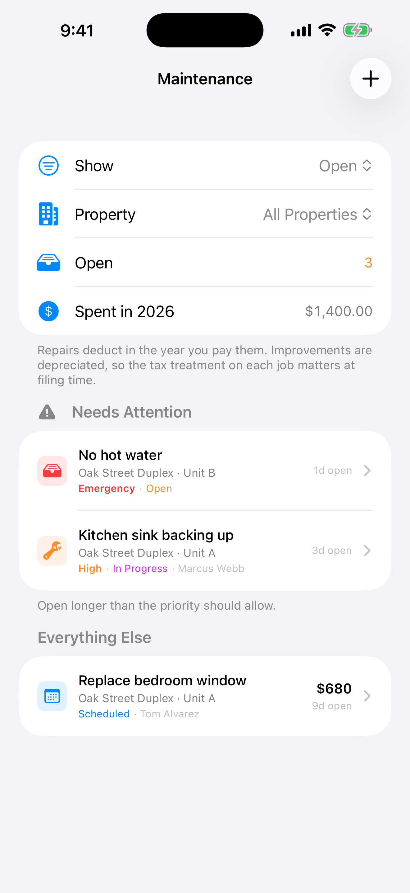

The text arrives at 7 a.m.: no hot water. You say you'll call someone. Then your day happens.

Maintenance requests are easy to lose track of when they arrive by text, in passing, or in the middle of something else.

<figure style="max-width:360px;margin:1.5rem auto">
<video controls playsinline preload="metadata" poster="/videos/rental-manager-maintenance-poster.jpg" aria-label="Rental Manager maintenance demonstration with demo data" style="display:block;width:100%;max-width:360px;border-radius:14px;background:#15110d">
  <source src="/videos/rental-manager-maintenance.mp4" type="video/mp4" />
  Your browser does not support embedded video.
</video>
<figcaption>Demo data. AI-generated narration.</figcaption>
</figure>

## What a good request record has

- **What's wrong, and where.** Property, unit, short description.
- **Priority.** An emergency and a squeaky door shouldn't wait in the same line.
- **Status.** Open, scheduled, in progress, done.
- **Who's assigned.** The vendor you called.
- **How long it's been open.** The easiest way to spot something slipping.
- **What it cost.**

## How Rental Manager helps

The **Maintenance** screen collects all of that. Each request carries a priority and status, the vendor you assigned, and how many days it has been open. Anything open longer than its priority should allow rises into a **Needs Attention** section, so the emergency doesn't hide under a to-do you can wait on.

*Demo data.*

You can filter by property and see how much you've spent on repairs this year. Keep the details and supporting records for each job. Check with a tax professional about whether a specific job is a repair or an improvement and how it should be treated.

## Make it a habit

Log the request the moment you hear about it, even before you've called anyone. A short record gives you something concrete to follow up on.

**[Download Rental Manager: Rent & Taxes on the App Store](https://apps.apple.com/us/app/rental-manager-rent-taxes/id6758280423)**
