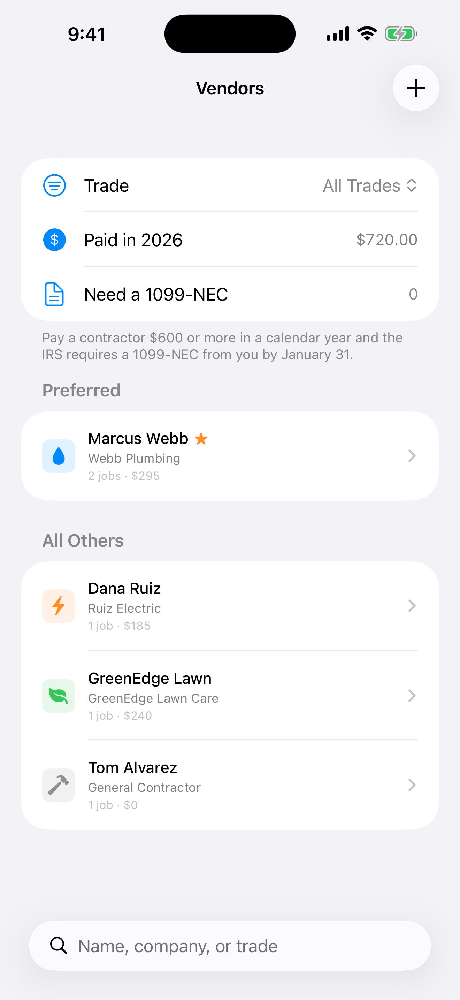

A pipe bursts on a Sunday. You remember a plumber who did a good job last year, but his number is somewhere in an old text thread. You're scrolling while water is on the floor.

Landlords work with a handful of trusted people: plumbers, electricians, lawn care, a general contractor. The information about them tends to live in too many places.

<figure style="max-width:360px;margin:1.5rem auto">
<video controls playsinline preload="metadata" poster="/randall/videos/rental-manager-contractors-poster.jpg" aria-label="Rental Manager contractors demonstration with demo data" style="display:block;width:100%;max-width:360px;border-radius:14px;background:#15110d">
  <source src="/randall/videos/rental-manager-contractors.mp4" type="video/mp4" />
  Your browser does not support embedded video.
</video>
<figcaption>Demo data. AI-generated narration. The video shows the app’s 1099 review indicator; check current reporting requirements with a tax professional.</figcaption>
</figure>

## What to keep for every contractor

- Name, company and trade
- Phone and email
- Which jobs they've done and where
- How much you've paid them
- Whether you'd hire them again

That last one matters. A short "preferred" list turns a panicked search into a single call.

## Don't forget the paperwork

Keep contractor payment records throughout the year so you can review reporting requirements without reconstructing everything in January. Check with a tax professional about current 1099-NEC thresholds, deadlines, payment methods and exceptions.

## How Rental Manager helps

The **Vendors** screen keeps your contractors in one searchable list, filtered by trade. Each one shows jobs done and total paid. You can star your favorites so they sit at the top under Preferred, and the screen shows how much you've paid in vendors this year and a 1099-NEC review count.

*Demo data.*

Vendors also connect to maintenance requests, so when you assign a job you're picking from the same list.

## Build the list now

Next time you hire someone good, add them right away. In six months you'll be glad it's there.

**[Download Rental Manager: Rent & Taxes on the App Store](https://apps.apple.com/us/app/rental-manager-rent-taxes/id6758280423)**
